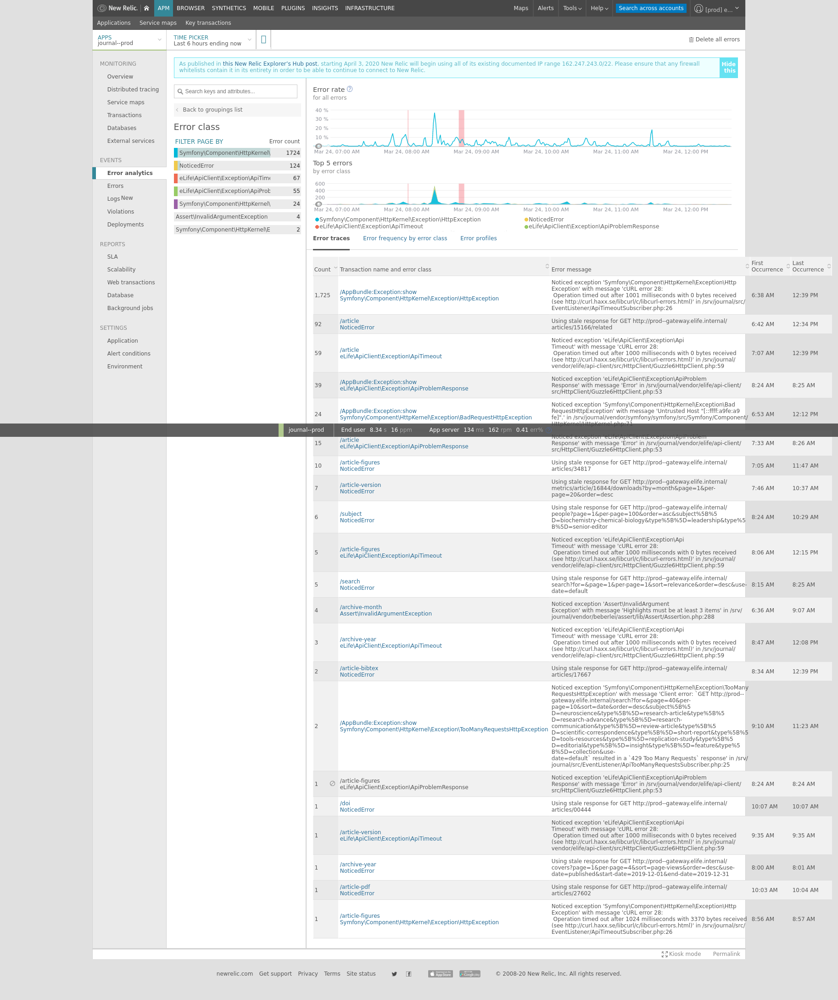

# iiif outage

* affected iiif--prod--* 
* affected for approximately 4 hours.
* caused by broken highstate, 16 failed states

On Monday iiif--end2end was upgraded to switch it's installation of iiif to a container. It failed the end2end tests 
and was left in a broken state for me to debug in the morning.

iiif--prod--* was insulated from this change through careful selection of states by environment in the master top file.

During development of the containerised version of iiif some configuration files were renamed or modified that would 
affect the state of the production environment. This was an oversight. This didn't appear to cause any problems during 
testing and it was never raised during review.

Daily system highstate ran on iiif--prod--* nodes approximately 7:45am my time (AEST) and I first noticed the failed 
highstates and (closed) elevated error alert from NewRelic approximate 9:45am.

The highstate had 16 failed states on each node, stemming from 3 configuration files that couldn't be found. A fourth 
configuration file that could be found and had incompatible changes *was* found but *was not* updated because of a 
dependency on a failed state.

I restored the three configuration files as they were prior to my containerisation changes and renamed the fourth, 
shared, configuration file used by both old and new environments so that old was preserved and new used a separate file.

The change was merged with the containerised build ('fresh') failing on one state, a race condition between the 
container being available and a smoke test checking for availability. This was observed Monday and was unrelated to
the current outage. As the containerised build is still not fit for deployment to production I made the decision to 
merge the changes and restore the iiif--prod--* node to a working state.

The changes were applied without issue about 11:45am. The APM error rate reported by NewRelic then petered out, see:



Juding by the nginx access logs, the period between failed highstate and restoration appears to concide with a gap in
successful responses:


```
43.249.75.20 - - [23/Mar/2020:21:16:00 +0000] "HEAD /ping-fastly HTTP/1.1" 200 0 "-" "Varnish/fastly (healthcheck)" 0.000
157.52.104.43 - - [23/Mar/2020:21:16:00 +0000] "HEAD /ping-fastly HTTP/1.1" 200 0 "-" "Varnish/fastly (healthcheck)" 0.000
157.52.79.35 - - [23/Mar/2020:21:16:00 +0000] "GET /lax:08419%2Felife-08419-fig4-figsupp5-v2.tif/full/full/0/default.jpg HTTP/1.1" 200 209689 "-" "GuzzleHttp/6.2.1 curl/7.38.0 PHP/7.1.28" 0.187
157.52.101.23 - - [23/Mar/2020:21:16:01 +0000] "HEAD /ping-fastly HTTP/1.1" 200 0 "-" "Varnish/fastly (healthcheck)" 0.000
10.0.2.46 - - [24/Mar/2020:01:17:52 +0000] "GET / HTTP/1.1" 200 220 "-" "ELB-HealthChecker/1.0" 0.004
10.0.3.69 - - [24/Mar/2020:01:17:53 +0000] "GET / HTTP/1.1" 200 220 "-" "ELB-HealthChecker/1.0" 0.002
127.0.0.1 - - [24/Mar/2020:01:17:57 +0000] "GET / HTTP/1.1" 200 220 "-" "curl/7.58.0" 0.012
```


